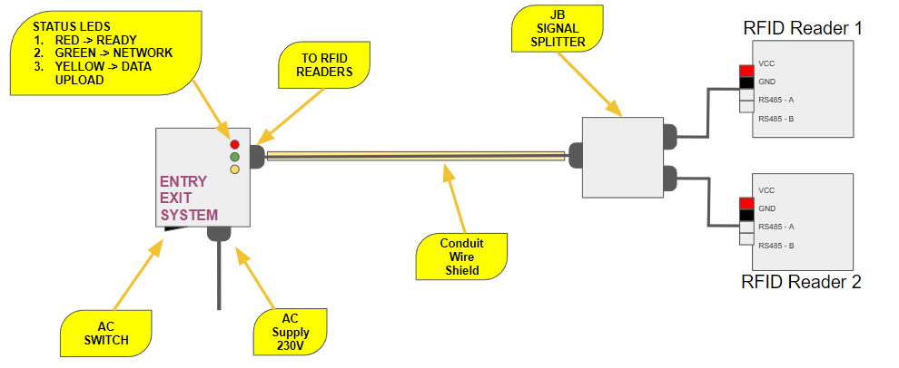
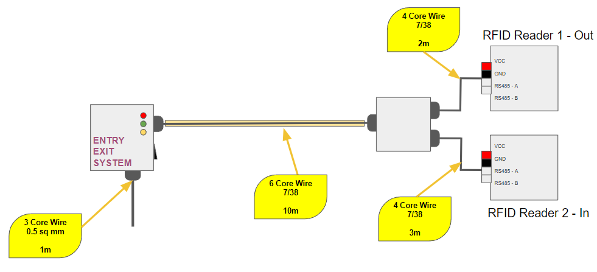
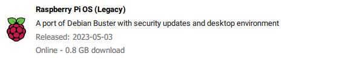
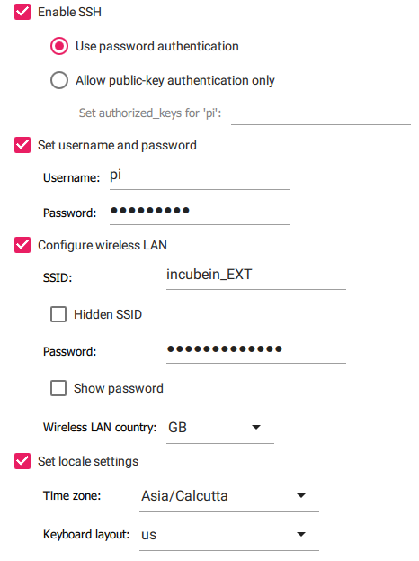
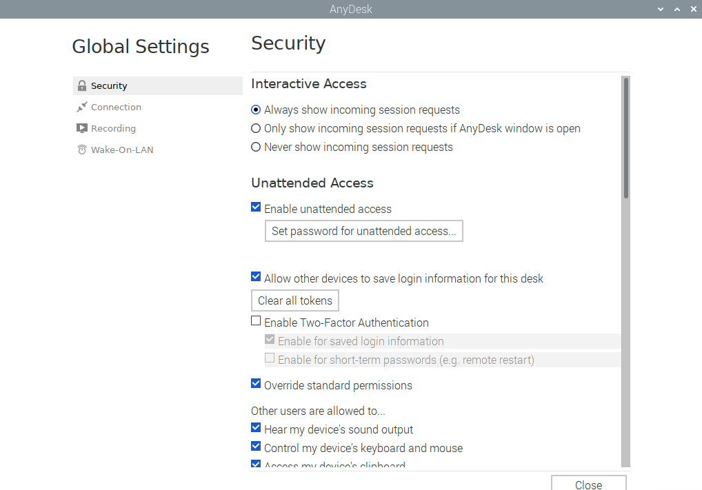

# Getting Started
Follow the steps to get started with building the system

## Wiring Diagram


### Wire Details


## Raspberry Pi Configuration
Once the system is wired up. 

Note: **Make sure to use Raspbian OS 32 bit Legacy. Latest Raspbian (Bullseye) is not supported by Anydesk**

* Download Raspberry Pi Imager from [here](https://www.raspberrypi.com/software/).
* Flash the SD card using a fresh Image of Raspbian OS 32 bit (Legacy).
* Open advanced settings page from the gear icon at bottom right corner.
* Enable SSH and WiFi using the advanced settings page.


* Once the SD card is flashed insert it into the Raspberry Pi and wait for the initial bootup
* Find the IP address of Pi and log into it via SSH
* Run the install script to install and update all the necessary things using 
```sh
$ sudo curl -fsSL https://raw.githubusercontent.com/Hixaa/eemsV2/main/install.sh | bash
```
* Enable VNC using `sudo raspi-config` by going in Interface Options.
* Connect with VNC and enable unattended access in Anydesk. To open the unattended access menu run `anydesk-global-settings` in terminal.

* Now you should have the whole system configured, to make the service on boot run
```sh
$ cd ~/eemsV2
$ sudo chmod +x onboot.sh
$ sudo ./onboot.sh
```

Now the installation is complete!
